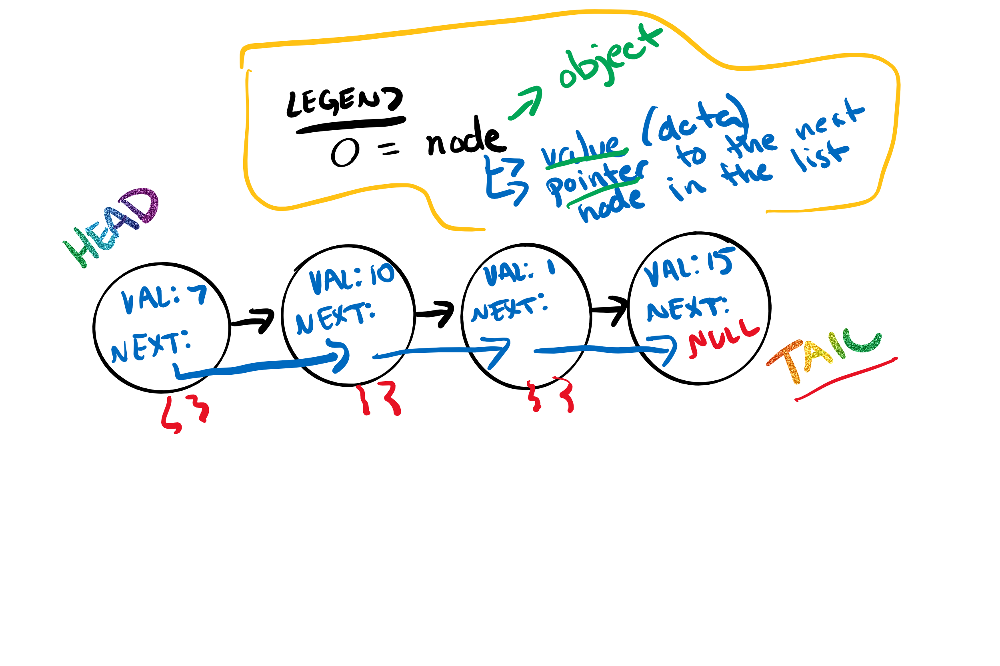

# Linked List

A linked list is a sequence of *Nodes* connected/linked to each other. Each *Node* refers to the next *Node* in the link.

## Terminology
### Linked List
A data structure that contains nodes that links/points to the next node in the list.
### Singly
Refers to the number of references the node has. A *Singly* likes list means that there is only one reference, and the reference points to the *next* node in a linked list.
### Doubly
Doubly refers to there being two (double) references within the node. A *Doubly* linked list means that there is a reference to both the *Next* and  *Previous* node.
### Node
Nodes are the individual items/links that live in a linked list. Each node contains the data for each link.
### Next 
Each node contains a property called *Next*. this Property contains the reference to the next node.
### Head
The Head is a reference type of type *Node* that is currently being looked at. This node is traditionally used when traversing through a full linked list.nWhen traversing, you typically reset the current to the head to guarantee you are starting from the beginning of the linked list.

